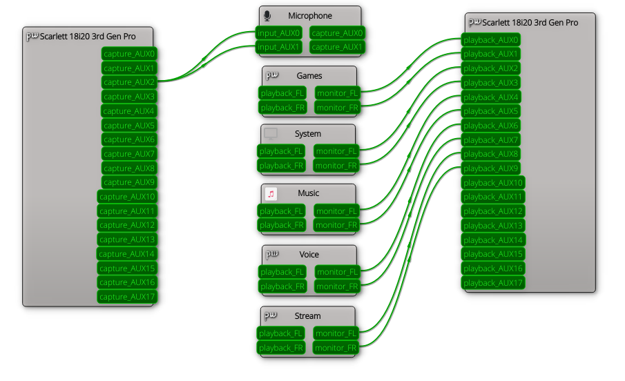
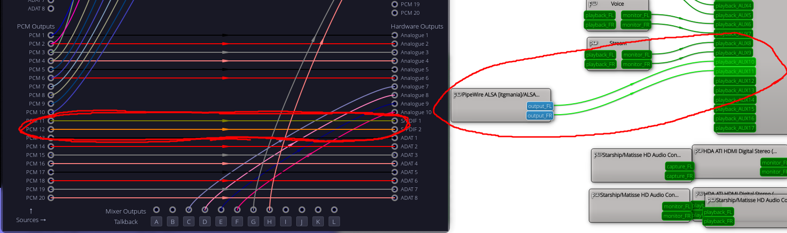

# Sample rate
[Reddit Question](https://www.reddit.com/r/linuxaudio/comments/15gmvn4/alsapipewire_unable_to_set_audio_interface_above/)  
  
Setting the sample rate comes in two parts: Setting the graph rate for Pipewire, and the probe rate for Wireplumber. The first half happens in `pipewire.conf` with the parameter `default.clock.rate = <rate>`. The second portion is slightly more involved. We need to set a rule for the alsa device matching our card name, and then specify the parameter `["api.acp.probe-rate"] = <rate>`.  
  
Note that the Focusrite Scarlett 18i20 disables its internal mixing logic above 96khz. After that only direct one-to-one connections are supported.  
  
### Current notes
~~There appears to be many layers to this part. At the top there exists the pipewire graph and the sample rate in which nodes transmit their data. This is easily configured inside of `pipewire.conf`. It further appears that nodes individually can be set, but the default behavior will use the graph rate.~~  
  
~~The audio interface acting up appears to be some ALSA issue or perhaps Wireplumber issue. Wireplumber provides a great list of potential properites that can be applied to the device, however none have any impact on the nodes representing it or the apparent behavior of the device. There is something about and ALSA plugin that these parameters may exist exclusively to control a node of this plugin.~~  
  
~~In addition, the 18i20 has none of the "params" listed in the output I should expect from `pw-dump` listed [here](https://gitlab.freedesktop.org/pipewire/pipewire/-/wikis/Config-Devices#runtime-settings). This suggests that something is being wrongly overridden, or that these parameters somehow do not apply to this device.~~  
  
~~If the graph rate is changed to 44100, the sample rate of the devices changes to reflect this. However anything above this remains at just 48000. If possible, it may be worth testing some sample sounds before any audio multiplexer is installed on the system at all.~~  
  
Pipewire has both Nodes and Devices, and both of which are separate entities. Almost always if a device exists, a node on the graph will represent it. Alas, what I failed to realize is that they each have their independent own sets of properties. All of my attempts at modifying configuration were inevitably modifying node properties and not device properties.  
  
The distinction between these is apparent in the name property. Devices are shown as alsa_card.\<device\> and nodes are shown as alsa_input or alsa_output.\<device\>.  
  
# Routing
### Purpose
The goal of the audio routing scripts is to create numerous endpoints to which audio can be played and then controlled independently. This is particularly beneficial with a multi-PCM audio interface such as a Focusrite Scarlett 18i20 where each virtual node can be interconnected with a PCM pair on the device, and routed independently. In essence, this means that I can seamlessly go from a Discord call on my headphones, to playing music through my desktop speakers completely automatically.  
  
### Design
A generic audio configuration takes nodes representing audio streams and links them directly to the default audio device. For a device with multiple interal PCM streams, a naive script would simply connect the nodes directly to the PCM ports. This proved to be ineffective as my intended use case with OBS was to monitor the audio categories independently. Further, this completely overrides any behavior with a default device selection, rendering the audio to feel "unwieldy."  

Instead, by creating virtual device nodes, these can connect to the PCM ports and effectively represent pairs of PCM ports as their own device. Specifying a PCM is now as simple as selecting a device from the list (or otherwise relying on the script with respect to how streams are routed.) The virtual nodes also have an infinite life, so manually linking nodes for a workaround setup need only be done once per session, as opposed to every time a new stream starts.  

  
_Basic routing configuration excluding any applications._

Audio routing follows the following categorization:  
```
<Default> -> virtual-games : (Intended for games as this is the largest category of executable names) 
System Audio -> virtual-system : (Shell sounds, web browsers, general desktop applications) 
Music Players -> virtual-music : (Cider, Spotify, etc.) 
Communication -> virtual-voice : (Discord, Teams, etc.) 
Stream Audio -> virtual-stream : (OBS: Browser sources and audio monitoring) 
```
  
Virtual nodes are routed as follows:  
```
virtual-games  :  AUX0 / AUX1 (PCM 1) 
virtual-system :  AUX2 / AUX3 (PCM 2) 
virtual-music  :  AUX4 / AUX5 (PCM 3) 
virtual-voice  :  AUX6 / AUX7 (PCM 4) 
virtual-stream :  AUX8 / AUX9 (PCM 5) 
```
  
### Modification
In its current configuration, the audio script functions exclusively by matching executable names to determine its output. By further modifying the relevant portion of `scripts/policy-node.lua` further functionalty could be added to match based upon the media class instead. This is a pipewire-provided property and can further be manipulated upon node creation by specifying an application rule. (See the [pipewire documentation](https://gitlab.freedesktop.org/pipewire/pipewire/-/wikis/Config-PipeWire#rules) or [wireplumber documentation](https://pipewire.pages.freedesktop.org/wireplumber/configuration/config_lua.html#split-file-configuration) for the respective options to do this.)  
  
Note that this alternative is unlikely to be any more performant than the current solution.  
  
### Installation
Enabling this functionality requires using the configuration files in both `/etc/pipewire` _**and**_ `/etc/wireplumber`. Modifying the virtual node names in the pipewire configuration will also require that they be modified in the object manager of the wireplumber scripts (`scripts/policy-node.lua`.)  
  
`scripts/policy-node.lua` overrides the copy located in `/usr/share/` by means of wireplumber's directory hierarchy functionality (akin to many applications in the open-source world.)  
  
To add an executable to the list, there is a Lua table located at the top of `scripts/policy-node.lua` where one can add the name of the executable. After doing so, run `systemctl --user restart wireplumber pipewire pipewire-pulse` (_**TODO:**_ Ensure that this is still the case if using a different init system!) to reload the configuration.  
  
Included in `/etc/wireplumber/util/` is a script that may serve useful to determine the executable name that corresponds with a given audio stream. By running `wpexec /etc/wireplumber/util/clients.lua` all suitable audio clients will be matched and enumerated to stdout. The script continues to run such that any additional clients added after the initialization of the script will also be shown. Alternatively, tools such as [Helvum](https://archlinux.org/packages/extra/x86_64/helvum/) or [QPWGraph](https://archlinux.org/packages/extra/x86_64/qpwgraph/) are very useful GUI routing tools. In my configuration, QPWGraph is my top choice, and great for use in manual overrides or troubleshooting new policies.  

### Audio Interface Mixer Configuration
_**TODO:**_ At some point while in windows, capture a screenshot of the mixer settings.  
_**TLDR:**_ Channels 1 - 10 (AUX0 - AUX9 / PCM 1 - PCM5) all route with a neutral mix to virtual outputs 9/10(?) for the headphone output.  
Currently channels 5/6 also route directly to SPDIF L/R outputs as well, though this will likely change such that an additional PCM6 will route here instead.  

  
_Verification that this idea will work!_

# Tools / Troubleshooting
### Scarlett Control Panel
Utility that provides a GUI for all the ALSA parameters available to Focusrite Scarlett devices. The state will generally be saved with the device.  
[alsa-scarlett-gui](https://archlinux.org/packages/extra/x86_64/alsa-scarlett-gui/)  
  
### PulseAudio Volume Control
Though this is intended for pulse audio, it works perfectly within pipewire for enumerating devices, setting profiles, and declaring the default device. It also supports managing stream volume, which functions properly, however it does so by intersecting streams instead of modifying the nodes directly.   
  
There exists a QT port of the following package  
[pavucontrol](https://archlinux.org/packages/extra/x86_64/pavucontrol/)  
  
### Carla
A powerful plugin host that supports the vast majority of plugin formats (VST2, VST3, LADSPA, LV2, etc.) This is mentioned here as Carla supports being ran standalone, which creates a node within the pipewire graph to which other nodes can be linked. This process could be automated with pipewire config to initialize the host (pipewire.conf -> context.exec), and wireplumber to link accordingly. (Run the program with `pw-jack` ; Further inspect section 4.6 of the Arch Wiki pipewire page.)  
[carla](https://archlinux.org/packages/extra/x86_64/carla/)  
  
### `pw-cli`
_**TODO**_  
Something something available categories : Device Node Client  
More categories : Props  
  
### `pw-dump`
_**TODO**_  
  
### `wpexec`
_**TODO**_  
Include description of wpexec versus core execution (Core, includes, etc.)  
  
### Change node volume via CLI
Use the command line utility `pactl`, see the example usage:  
`pactl set-source-mute virtual-music.monitor toggle`  
Additional options include incrementally modifying the volume, or suspending a node outright. `pactl` can also be used to play samples akin to `pw-play` or `aplay` (if `alsa-utils` package is installed.)  
  
### Change pipewire graph rate at runtime
`pw-metadata -n settings 0 clock.force-rate <rate>`  
Possible rates include: 44100 48000 88200 96000 ...  
  
### View ALSA device metadata
`cat /proc/asound/<card>/<pcm>/<subdevice>/hw_params`  
`<card>` fits the format of `card#` where `#` is an integer value (ex `card3`)  
`<pcm>` fits the format of `pcm#@` where `#` is an integer value and `@` is either c or p (ex `pcm0p`)  
_^^`c` refers to capture and `p` refers to playback_  
`<subdevice>` fits the format of `sub#` where `#` is an integer value (ex `sub0`)  
  
An example usage with a complete path: `cat /proc/asound/card3/pcm0p/sub0/hw_params`  
  
It should be noted that the other files within the `/proc/asound/` directory can be inspected in a simliar fashion for the relevant stored information.  
  
### Additional resources
[Arch Wiki Pipewire](https://wiki.archlinux.org/title/PipeWire)  
[Arch Wiki Wireplumber](https://wiki.archlinux.org/title/WirePlumber)  
[Arch Wiki ALSA](https://wiki.archlinux.org/title/Advanced_Linux_Sound_Architecture)  
  
[Pipewire Configuration](https://gitlab.freedesktop.org/pipewire/pipewire/-/wikis/home)  
[Wireplumber Documentation](https://pipewire.pages.freedesktop.org/wireplumber/index.html)  
[Wireplumber Source Code](https://gitlab.freedesktop.org/pipewire/wireplumber)  
  
[Pipewire Guide](https://github.com/mikeroyal/PipeWire-Guide)  
_This is a collection of projects and applications relevant to audio production._
  
# To-Do
### Speaker Switching
Determine a system by which I could toggle between all sounds or just music going through the desktop speakers. So far I am considering having the default behavior be that all nodes are connected directly to the mixer (merged internally into the headphones) as well as an additional mixer PCM used as the speaker output.  
  
With this configuration, speaker "usage" is a matter of linking (or unlinking) the static nodes on the graph. Activities in which I'd prefer to use the speakers are far less likely to make the (likley neglibible) latency a concern.  

### Mixer Device
_**TODO:**_ Finish this writeup - Add links to various resources here as I research them  
  
_**TLDR:**_ Make a physical device that could run various commands to change node volume, mute nodes, or swap speaker modes as a somewhat of a "mixer"-feeling interface  
