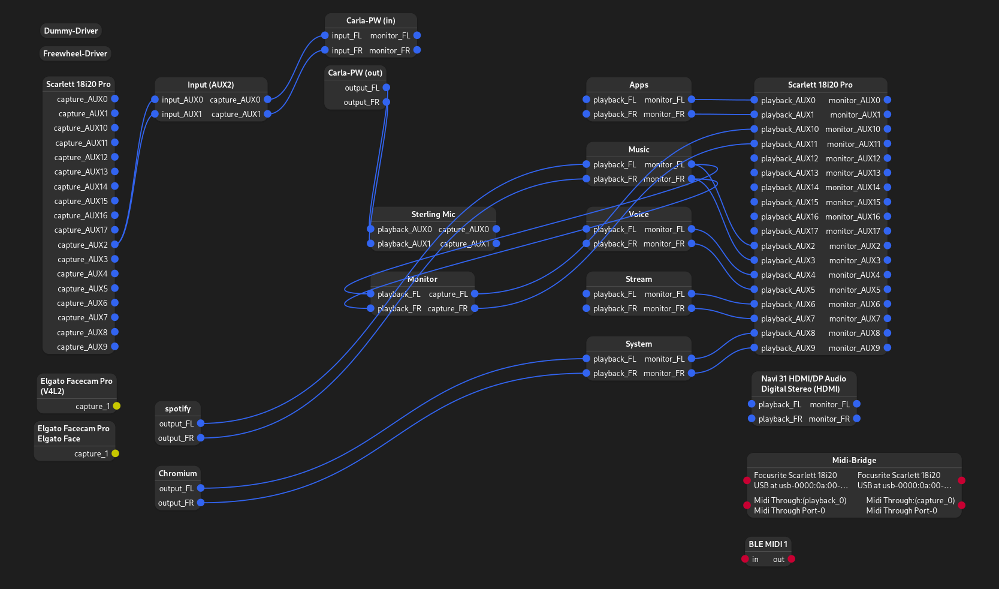
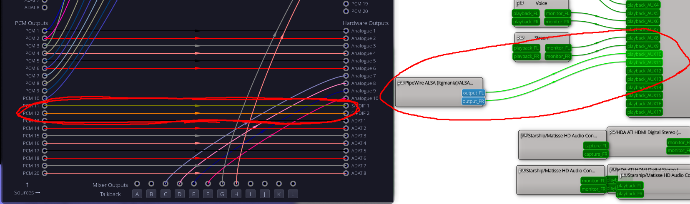
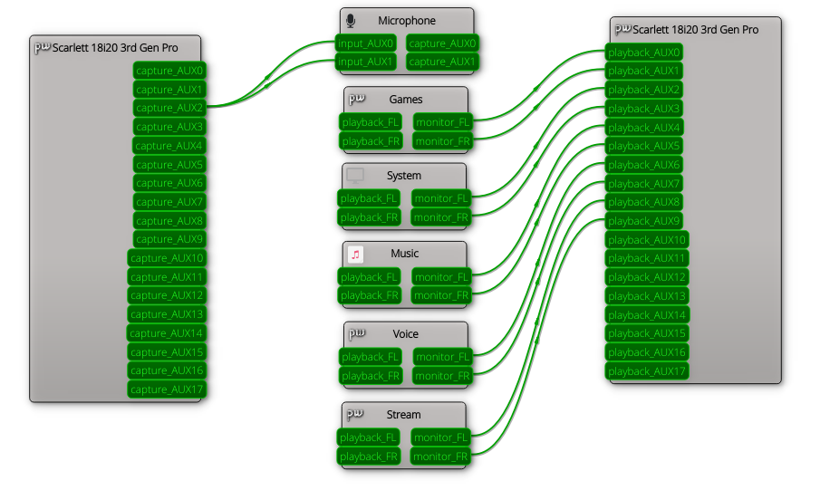

# Pipewire + Wireplumber Config/Scripting

# Overview
Both Pipewire and Wireplumber have relatively comprehensive documentation. For specific details, one should seek that as a reference. The goal of this write-up is to provide a much more "big-picture" overview of the role of each of the subsystems, how they work together, and clarifying some of the components relevant to configuration that are not immediately apparent.

### Pipewire Resources
> [Pipewire - Pipewire Docs](https://docs.pipewire.org/page_overview.html)  
> [Pipewire - Freedesktop.org](https://gitlab.freedesktop.org/pipewire/pipewire)  
> [Pipewire - Gentoo Wiki](https://wiki.gentoo.org/wiki/PipeWire)  
> [Pipewire - Arch Wiki](https://wiki.archlinux.org/title/PipeWire)  
> [Pipewire Examples - Arch Wiki](https://wiki.archlinux.org/title/PipeWire/Examples)  

### Wireplumber Resources
> [Wireplumber - Freedesktop.org](https://pipewire.pages.freedesktop.org/wireplumber/index.html)  
> [Wireplumber - Arch Wiki](https://wiki.archlinux.org/title/WirePlumber)  

### Source
> [Pipewire Source Repo](https://gitlab.freedesktop.org/pipewire/pipewire)  
> [Wireplumber Source Repo](https://gitlab.freedesktop.org/pipewire/wireplumber)  

### Extra
> [Pipewire Guide - Github](https://github.com/mikeroyal/PipeWire-Guide)  
_This is a collection of projects and applications relevant to audio production._

## Pipewire
By itself, Pipewire is no more than a graph API (analgous to a real-time, process version of gstreamer.) It provides functionality by which it's modules can interact with the graph, and share data from one to the other. This is particularly beneficial in the case of audio, where only one audio stream can be sent to a device at a time, meaning that a multiplexing *middle-man* is necessary for a user to hear multiple streams at one (such as music and a video game.)

### Nodes
A notable feature is that everything that interfaces with pipewire will be represented as a _**node**_ (at least in the sense of sharing data between each other.) Clients may connect to pipewire and see information about the graph, but in order to send or receive data, it *must* be done so through a node.

#### // Types
As nodes are the unified means by which clients can communicate, they come in many forms. For the sake of simplicity, we can reduce them to two major categories: _adapter_ nodes, and _stream_ nodes. The former generally represent some form of device, be it physical or virtual, and the latter generally represent data that is being provided or processed by an application. This distinction is important as it pertains to configuration.

### Modules
Modules are essentially plugins, and are the exclusive interface by which the Pipewire graph is provided functionality. Device nodes will only exist when the session manager creates one through the _devices module_. Nodes corresponding to applications require the _clients module_, and even native pipewire functionality like loopbacks or filter processing nodes must come in the form of a module in order to exist on the graph.

_All modules are found in `/usr/lib/pipewire-0.3/`_

As a technicality, Pipewire modules provide _**factories**_. The "factores" are what are responsible for generating the nodes on the graph. However, this system becomes convoluted with respect to SPA libs. _The following is my best guess as to how the system works._

SPA plugins provide an additional class of "factories." Unlike those from modules (which can be called in the `context.objects` section of the configuration) these factories are used by node factories to specify the intended functionality of the node. This is relevant for "SPA-dependent modules" such as `adapter` which can be any number of SPA plugin such as `support.null.audio-sink`. The `context.spa-libs` configuration specifies what factory names can be found in which SPA libs, as each SPA lib can provide any number of factories.

From [Pipewire.org - SPA (Simple Plugin API)](https://docs.pipewire.org/page_spa.html):  
> SPA plugins are shared libraries (.so files) that can be loaded at runtime. Each library provides one or more "factories", each of which may implement several "interfaces". Code that uses SPA plugins then uses those interfaces (through SPA header files) to interact with the plugin.

_All SPA plugins are found in `/usr/lib/spa-0.2/`_

### Clients
Native pipewire applications will connect to Pipewire as a _**client**_. To reiterate, the ability for the client to generate nodes depends upon the factories loaded into the pipewire instance. _Every_ subsequent pipewire-related application is its own client; there exist muliple notable clients that the average use would want to use: `pipewire-pulse`, `pipewire-jack`, `alsa`, and `wireplumber`.

As it regards configuration, each client may specify its own configuration file name. Absent this, any client will default to `client.conf` (or `client-rt.conf` depending on the environment.) The following are the default configuration file names for the major clients:  
- Pulseaudio ➤➤ `pipewire-pulse.conf`
- Jack ➤➤ `jack.conf`
- ALSA ➤➤ `client.conf`
- Wireplumber ➤➤ `../wireplumber/wireplumber.conf` (A particularly unique client)

_Many Pipewire clients also allow the configuration file name to be overridden with the `-c` launch option._

As a result of this, various pipewire programs can be ran in unconventional ways. Pipewire-pulse can be ran with the command line: `pipewire -c pipewire-pulse.conf`. Even the reverse is true: The "base" pipewire daemon can be ran with `pipewire-pulse -c pipewire.conf`.

#### // Non-native applications
Applications that do not natively interface with pipewire will instead rely on a client that can translate API calls from one protocol to those of Pipewire. The most notable example of this is `pipewire-pulse`.

As pulse applications depend on a "pulse server" in order to broadcast their audio, `pipewire-pulse` is also a user daemon that implements the same set of API endpoints as the base pulse server would. It then passes these calls into the Pipewire equivalent such that pulse applications can seamlessly interact with the Pipewire graph.

Jack clients _(this is another component that is my best guess)_ do not look for a server, but instead refer to a specific library to handle audio routes. As such, `pipewire-jack` does no more than substitute this library. Further, an executable `pw-jack` is provided that can wrap the command line for a jack application.

### Metadata
Pipewire metadata can be simply described as: information about the audio graph that should be saved and restored, such as the default audio device.

### Configuration
#### // Sample rate (+latency)
The sample rate and latency of audio streams is unassumingly complex in Pipewire, but this is a necessary consequence of the modular design. For any given link, there are three unique places where sample rate and buffer size come into consideration:
- Node rate (input)
- Graph rate
- Node rate (output)

The graph rate is the rate by which Pipewire handles all of the audio processing. Streams will first be resampled to match that the graph rate (if they do not already match, of course) and then said stream will be resampled back to that of the output node. _There exist some additional caveats._

_**NOTE:** For the sake of simplicity, the assumed flow for the following explanation is an output stream connected to a sink device (i.e. spotify -> headphones.)_

Pipewire will attempt to set the output node (aka the device node) to the graph rate, or otherwise get as close as possible to it. If this was successful, then no output-side resampling will be necessary. That said, device sample rate can also be convoluted. In the case of my Focusrite Scarlett 18i20 audio interface, it provides three "modes" (_altsets_.) Altset 01 allows the device to run with a 44.1khz or 48khz sample rate. Altset 02 allows for 88.2khz and 96k. Finally altset 03 allows for 176.4khz and 196khz. 

It is important to note that the device behaves differently depending on which altset it is using. Here notably, internal mixing is disabled above 96khz, meaning that only one-to-one routing is supported. As a result, setting the "mode" depends on how the device is initalized, which is a responsibility of the session manager.  
_See further: [Use all inputs on the 18i20 - Focusrite Support](https://support.focusrite.com/hc/en-gb/articles/206850129-How-do-I-use-all-18-inputs-on-the-Scarlett-18i20)_

As a result, if the graph rate is say, 96khz, and my audio interface is in altset 03, Pipewire will set the device to 176.4khz sample rate as soon as a stream is connected to the device node, as this is the closest possible sample rate.

Source stream nodes are handled analogously. If the application supports an arbitrary sample rate, then it will be set to run at the sample rate that matches that of the graph. Carla running in pulse mode is a great example of this behavior. That said, not all applications support this, such as Spotify. The overwhelming majority of music is recorded in 44.1khz or 48khz. As a result, Spotify does not do any resampling, it only outputs audio in the sample rate of the song it's currently playing. Pipewire cannot "forcibly" change the output rate of Spotify.

#### // Context
_**TODO:** I have yet to fully understand the context portion of the configuration._  
That said, context is available for any given Pipewire client, and appears to provide "context" that the client can reference. Notably, context in `pipewire.conf` specifies things such as `default.clock.rate` which is the graph rate used by Pipewire. Clients with their own context configuration will have these properties reflected in the properties of nodes created by said clients, however I cannot find any examples of them taking effect. As such, some nodes may report a setting such as `default.clock.rate` as something that does not match that of the pipewire graph, even though looking at the format parameter shows that it is running at the rate of the graph anyway.

#### // Default files
The contents of `/usr/share/pipewire/` can prove intimidating as there are many files. Some of these files are provided as the default files for their respective clients, however not all of them are used. Some are just examples that can be conveniently ran with `pipewire -c <conf/file>` to quickly change over to slightly different functionality for specific use cases.

## Wireplumber
Wireplumber is a _session manager_ client for Pipewire. As the latter provides only a graph API and module support (where said modules are used to create objects on the graph) there is no logic for configuring/initalizing said objects, nor enforcing a policy as to how they should behave by default (aka what should be automatically linked to what.) It is the responsibility of the session manager to monitor for ALSA devices and spawn the relevant nodes on the Pipewire graph as these can appear and disappear from the system at any time just like a source would such as Spotify.

From [Freedesktop - Wireplumber's Design](https://pipewire.pages.freedesktop.org/wireplumber/design/understanding_session_management.html#understanding-session-management):
> The PipeWire session manager is a tool that is tasked to do a lot of things. Many people understand the term “session manager” as a tool that is responsible for managing links between nodes, but that is only one of many tasks. To understand the entirety of its operation, we need to discuss how PipeWire works, first.  
>  
> When PipeWire starts, it loads a set of modules that are defined in its configuration file. These modules provide functionality to PipeWire, otherwise it is just an empty process that does nothing. Under normal circumstances, the modules that are loaded on PipeWire’s startup contain object factories, plus the native protocol module that allows inter-process communication. Other than that, PipeWire does not really load or do anything else. This is where session management begins.  
>  
> Session management is basically about setting up PipeWire to do something useful. This is achieved by utilizing PipeWire’s exposed object factories to create some useful objects, then work with their methods to modify and later destroy them. Such objects include devices, nodes, ports, links and others. This is a task that requires continuous monitoring and action taking, reacting on a large number of different events that happen as the system is being used.  

### Session items
_**TODO:** I have yet to fully understand the role (or the difference) of session items, however it is apparent that these are the protocol by which Wireplumber handles the graph objects._  
To the best of my understanding, session items are effectively a superset of a pipewire object. The contain a reference to the underlying Pipewire object (this is the structure that is available on the graph itself) as well as additional metadata used by the session manager with respect to its operation.

_Pipewire objects are exposed to the Lua scripting API as GObjects; this may be a result of these objections being session items._

With respect to the `si-standard-link` type:
> As my roughest guess of what a session item is while digging into the system further: It appears that from the perspective of wireplumber, a session item can be thought of as a "temporary rule" i.e. "these two nodes should be linked" / "this client should have a node with this many ports." (Of course, the former is a more relevant example for the standard-link.)  
>  
> Ultimately what this means, is that for as long as a session item link is present in wireplumber's context, it will ensure that a pipewire link exists between nodes specified in the link config. Things such as manually removing the link, will trigger wireplumber to "remove" the corresponding session item.  
>  
> See `module-si-standard-link.c#create_links()`:  
> https://gitlab.freedesktop.org/pipewire/wireplumber/-/blob/master/modules/module-si-standard-link.c?ref_type=heads#L278  
>  
> As a further side effect of this, the `si-standard-link` _**factory**_ provided by this module specifies to which ports it believes that it should connect. For every port on the main object, it will loop through every port on the target object and determine the "best port" and then create a standard PW link between them. See lines `#321` to `#361` on the same file. Thus, we cannot specify which ports to link without modifying our port names elsewhere.  
>  
> Finally, this module demands that the target input/output nodes are both SiLinkable session items, further complicating things.  
>  
> For an example of this discrepancy, consider what happens when starting up the audio subsystem. Wireplumber may exist, but it has not yet initalized all of the nodes. If we were to have `wpexec <some-script>` with the goal of creating some links between nodes immediately after launching the daemon, using a standard link would fail as the ports would not exist. A session item, however, would benefit from wireplumber's internal state machine processing, and the connections would be generated after the ports become available.  

Wireplumber's alternative "audio ducking policy" from which my new configuration took great inspiration features virtual nodes spawned from Wireplumber:  
> Creating one of these nodes appears on the pipewire graph as a standard `support.null-audio-sink`. This seems consistent with the other session items, who all have a "si:proxy" component representing an object on the graph, but alas the actual element appears to be a simple null sink as we've generated before. The other conundrum becomes the configurability of the item. Many features, such as whether the object lingers or autoconnects appears to be handled by the respective session item factory, which substantially complicates things such as adding custom properties.

To create a node, I was partially successful in doing so by appending the following code to `scripts/node/create-virtual-item.lua`
```lua
local testprops = {
    ["name"] = "test",
    ["media.class"] = "Audio/Sink",
}
createVirtualItem ("si-audio-virtual", testprops)
```

See also: [Wireplumber - Session Item](https://pipewire.pages.freedesktop.org/wireplumber/scripting/lua_api/lua_session_item_api.html)

### Configuration
#### // Device Sample Rate
To set a device's sample rate (rather, the altsetting that would contain a specific sample rate, if supported) Wireplumber needs to initalize the device as such. This is handled by specifying the _ACP probe rate_ in `monitor.alsa.rules`.  

> `${CONFIG_DIR}/wireplumber.conf.d/*.conf`
```conf
monitor.alsa.rules = [
    # ...
	{	## Focusrite Scarlett 18i20 Audio Interface
		matches = [
			# alsa_card.usb-Focusrite_Scarlett_18i20_USB_P9CZXTW0C83711-00
			{ device.name = "~alsa_card.usb-Focusrite_Scarlett_18i20_USB_*" }
		]
		actions = {
			update-props = {
				alsa.use-acp 			= true			# Appears to be true by default
				api.acp.probe-rate 		= 96000         # Try to initalize the device with sample rate: 96khz
			}
		}
	}
    # ...
]
```

[Drayux: Unable to set audio interface above 48khz - Reddit](https://www.reddit.com/r/linuxaudio/comments/15gmvn4/alsapipewire_unable_to_set_audio_interface_above/)

#### // Features
As of version 0.5.0, Wireplumber now defines its behavior with _**features**_. Each feature refers to a module (in a simliar fashion to Pipewire modules) or a lua script. The full extent of Wireplumber's linking policy is described by features in the form of lua scripts.  
_Technically there are more feature types, but this is sufficient for the sake of describing the idea._  

Features will only be loaded if the wireplumber profile (defaults to `main`) specifies them as "required" or is otherwise a "requires/want" of a feature that is specified as required in this way.

Each lua script as a feature is ran on its own, but as these scripts all feature C bindings to Wireplumber's API (exposed through the lua scripting module) they can all modify the same state. Notably, most of these scripts add event listeners to the event handler, which respond to certain types of events with functions. Each script can add its own event response, but they are all emplaced into the same handler.

# Configuration
Not to be confused with the configuration properties of specific interest, this section is an overview of my custom audio configuration as it pertains to my setup. _Basically an explanation of my dotfiles._

## Overview
The primary role of my audio configuration is to provide virtual endpoints for various audio streams, matched based upon their executable name, and to interact with my audio interface such that it takes advantage of its multitude of channels.



As per my audio interface's internal mixing, channels 1 - 10 are all merged into output 9/10 (the front-panel right headphone jack.) Channels 11/12 route to the coaxial S/PDIF output, which is connected to my speakers. Pipewire knows nothing of this interal routing. It handles only what PCM ports receive which audio streams. I use the utility `alsa-scarlett-gui` (in place of its Windows couterpart: Focusrite Control) to handle the internal mix.


_(Left: `alsa-scarlett-gui` | Right: `qpwgraph`)_

_**NOTE:** This audio configuration depends on both Carla and LSP audio plugins._

### Design
A generic audio configuration takes nodes representing audio streams and links them directly to the default audio device. For a device with multiple interal PCM streams, a naive script would simply connect the nodes directly to the PCM ports. This proved to be ineffective as my intended use case with OBS was to monitor the audio categories independently. Further, this completely overrides any behavior with a default device selection, rendering the audio to feel "unwieldy."  

Instead, by creating virtual device nodes, these can connect to the PCM ports and effectively represent pairs of PCM ports as their own device. Specifying a PCM is now as simple as selecting a device from the list (or otherwise relying on the script with respect to how streams are routed.) The virtual nodes also have an infinite life, so manually linking nodes for a workaround setup need only be done once per session, as opposed to every time a new stream starts.  

### Virtual Sinks
**Apps** ➤➤ Primary system applications (`routing.applications`)  
_Can generally be thought of as "exclusive" applications, where we will only expect to receive audio from one process of this class at a time._  
> _Examples:_ Resolve, Alien: Isolation, VSCodium (if it had sound), Audacity

**Music** ➤➤ Multimedia applications (`routing.media`)  
_Anything that plays music or video; Music is the most relevant consideration here as it may frequently be played in the background._
> _Examples:_ Spotify, VLC, Firefox (as I play music more commonly than I use it as a "primary application")

**Voice** ➤➤ Communication applications (`routing.voice`)  
_Applications whose focus is communiation with others, notably with a focus on voice-based services._
> _Examples:_ Discord, Teams, Zoom, Skype (ew)

**Stream** ➤➤ Broadcast-related audio streams (`routing.stream`)
_Generally used for audio monitoring purposes when broadcasting or recording._  
_(Notably alert sources will be set to "monitor and output" where this route is used for the monitoring output, allowing me to easily mute notifcations for myself only.)_
> _Examples:_ OBS, Carla, Reaper, FLStudio

**System** ➤➤ System audio / Default sink (`routing.system`)
_Miscellaneous sounds--most frequently notifications--that are created from processes such as the desktop shell._
> _Examples:_ Gnome Shell, Steam

---

**Monitor** ➤➤ Virtual sink aggregation (`routing.monitor`)  
_This node is not meant to be a route in of itself, but instead it exists to connect its output to certain devices (such as the speakers output on the audio interface or the VR headset) such that they can "enable or disable" monitoring for any arbitrary subset of the available routing nodes. By creating a common endpoint, this functionality can be provided by an additional `wpexec` script._

### Microphone
The microphone configuration is less intuitive as a result of a couple factors:
- The PCM channels provided by the audio interface (mic plugs into channel 3 - aka `AUX2`)
- The dependency on filters to bring the mic to its best quality

Carla is my preferred way to handle mic filters. It supports a wide variety of plugin types, supports multiple audio APIs, supports running in headless mode, and offers its own internal patchbay. My previous configuration used an OBS plugin such that a nested Carla graph would run with OBS. This was flawed, as communications with friends would not have processed audio, and many would struggle to hear my voice.

The best solution I could find thus far, is to run an instance of headless Carla as part of the audio subsystem, and provide it custom rules for which nodes to target. As a result, we create two additional virtual nodes: A raw node to "convert" the specific mic channel (`AUX2`) into a two-channel "device" and a post-processing node, that is also two channels and can be selected as a default audio device.

The Carla graph can be edited with the `carla-control` program. It should be noted, however, that this does not support saving the project to its file, so these changes will be reverted upon a restart of the audio subsystem.

_**NOTE:** For this to work properly, Carla should be running with the Pulse API and also have the `carla-control` server enabled._

### Scripts
**Audio subsystem launcher** ➤➤ `audio-exec`  
This is a bash script which handles launching (and stopping) the audio subsystem. Since Pipewire and Wireplumber are both "user" daemons, they do not have a global service file. Thus, we instead start them via an autostart entry (`~/.config/autostart/...`) which runs this script.

This script will save the logs of each audio process in the directory `/home/.var/log/audio/`. Using the optional parameter `restart` will kill an instance of this script if it already exists, and relaunch the audio subsystem whilst preserving the contents of the log files. Else they will be reset at each launch.

It is responsible for starting `pipewire`, `pipewire-pulse`, `wireplumber`, and `carla-rack`.  

It should also be noted that this script specifes non-standard configuration locations for Wireplumber, consistent with the dotfiles organization found in this repository. As Wireplumber is a client of Pipewire, I personally like to have its configuration located alongside the other client configuration within the `pipewire/` directory.

**Monitor link management** ➤➤ `monitor`  
> _**NOTE:** This script is a work in progress. I am running into difficulties with the (lack of) functionality supported by `wpexec`._  

This is a one-shot script that runs via `wpexec` and will dynamically link or unlink routing nodes to the monitor node. It takes its arguments in the form of a WpJson object.

> `monitor '{ target = <target> mode = <mode> }'`  
> `monitor '{ target = [ <list of targets> ] mode = <mode> }'`  

**target** ➤ Can be a target node or a list of nodes (optionally `all` for all routing nodes)  
_**NOTE:** `routing.<name>` is automatically prefixed._  

**mode** ➤ Optional, can be `connect`, `disconnect`, or `toggle` (default)  
For toggling functionality, if a specific list is provided, then their connection state will each be toggled  
If "all" is specified, then all links will be disconnected if any routes are already connected, else all will be connected

### Volume Mixer Device
> _**NOTE:** This is a future project!_

**Summary:** Inspired by the [Streamdeck+](https://www.elgato.com/us/en/p/stream-deck-plus-black), I want to create a version of this for my own setup that provides 5 knob/button pairs.  

Each of the knobs would correspond to the volume of a virtual routing node (as per the node configuration itself) and the buttons would toggle the respective node's connection to the monitor node.

## Config Entries
The following are entries with custom components (or are otherwise custom in their entirety) as they regard the custom routing configuration.

### `pipewire.conf`
Routing nodes are specified within `context.objects`.  

**Notable parameters:**
```conf
node.name                   = routing.<name>        # The routing prefix is required for the routing configuration
monitor.passthrough         = true                  # Allows latency info to be reported through the monitor ports
monitor.channel-volumes     = true                  # Changing node volume also applies to the monitor ports
object.linger               = true                  # The object will remain on the graph even if inactive
```

### `<client>.conf`
Define match rules for specific nodes that determine their routing path. The vast majority of applications still use Pulseaudio, so `pipewire-pulse.conf` is the typical filename for this portion of the configuration.

**Example:**
```conf
pulse.rules = [
    # ...
	{	## COMMON APPLICATIONS (games, utilities, etc.)
		matches = [
			{ application.process.binary = "steam" }
			{ application.process.binary = "wine64-preloader" }
		]
		actions = { update-props = { media.route = "applications" }}
	}
	{	## MULTIMEDIA (music, video, etc.)
		matches = [
			{ application.process.binary = "firefox" }
			{ application.process.binary = "spotify" }
		]
		actions = { update-props = { media.route = "media" }}
	}
	{	## COMMUNICATION (discord, teams, zoom, etc.)
		matches = [
			{ application.process.binary = "vesktop.bin" }
		]
		actions = { update-props = { media.route = "voice" }}
	}
    # ...
]
```
In this case, `media.route` is the important property: This is a custom property used by our Wireplumber scripts to determine which routing node to connect to when routing mode is active.

Note that `pulse.rules` specifies rules for pulse clients directly. Any properties specified here will be passed through to nodes spawned from the respective client. This makes exectuable name matching particularly convient. That said, if a specific stream type must be matched (such as input/output with the carla nodes) then `stream.rules` must be specified instead. This is also the property to use for non-pulse clients.

### `wireplumber.conf`
Our Wireplumber configuration depends on the `monitor.alsa.rules` section, as well as a fully custom section: `routing.devices`

In `monitor.alsa.rules` we need to match any ALSA devices of interest for the routing logic, and provide the custom parameter: `routing.name`. This parameter specifies a "friendly" name for use in the `routing.devices` section.

Any device listed in `routing.devices` will be considered a "routing device." If one of these devices is the default output device, then the routing functionality will be enabled. Else streams will route directly to the default device as they would absent of these scripts.

**Example:**
```conf
routing.devices = {
    # "Friendly" names provided by the custom `routing.name` parameter
	scarlett-18i20 = {
        # Connect routing.input-2 to the Audio/Source node ports
		capture = {
			input-2			= [ AUX2 AUX2 ]
		}

        # Connect the routing nodes to the respective Audio/Sink node ports
		playback = {
			applications 	= [ AUX0 AUX1 ]
			media 			= [ AUX2 AUX3 ]
			voice 			= [ AUX4 AUX5 ]
			stream 			= [ AUX6 AUX7 ]
			system 			= [ AUX8 AUX9 ]
		}
	}
	
	# Devices can have empty configuration so that they enable routing rules without having any paths of their own
	navi-audio = {}
}
```

## Design
We add two additional lua scripts as features to Wireplumber. The new configuration schema is awesome as I am no longer overriding the existing scripts, and toggling them on or off is as simple as editing a single value in the profile configuration.

### Link device routes (`routing/link-device-routes.lua`)
This script is responsible for linking ALSA device nodes to routing nodes. This is what provides the custom `routing.devices` configuration section. Simply described: It hooks the "node-added" event provided by libwireplumber. For each ALSA device found through this event, it will seek a respective configuration entry. If found, it will iterate through the ports of the virtual device, and link to the listed port names on the routing device. As this is handled on an event basis, it means that the links will be restored if the device is disconnected and subsequently reconnected.

### Find routing target (`routing/find-routing-target.lua`)
This script is what handles the application-specific routing. As part of the "stock" scripting, Wireplumber provides a hierarchy of hooks that seek to determine the most appropriate target for a given node.

    linking/find-virtual-target     # This is only present when running the alternative audio ducking policy
    linking/find-defined-target     # Checks for the `node.target`/`target.object` property
    > routing/find-routing-target   # This is where we perform our custom routing
    linking/find-filter-target      # Handles smart filters
    linking/find-default-target     # Link to the default node otherwise
    linking/find-best-target        # Find the most appropriate node if no default is set
    
    # The above will specify a target, the following handle the next steps
    linking/get-filter-from-target  # More smart filter handling
    linking/prepare-link            # Clears any pre-existing links in preparation of creating the new ones
    linking/link-target             # Actually creates the new link session items

_The selected target is specified via `event:set_data ("target", target)` where the subsequent events will immediately resolve if this is already set._  
Refer to: [Linking Scripts - Wireplumber Documentation](https://pipewire.pages.freedesktop.org/wireplumber/scripting/existing_scripts/linking.html)  

## Workarounds
I've recently observed an issue with Wizard101 (though this may apply to other proton applications?) where if my audio interface is selected as the default device, a node fails to generate. This happens even if I fully revert back to "stock" configuration. Further, I used my old configuration with one of the routing sinks as a default device for so long, I have no clue when this issue may have first arisen.

Alas, even with the routing policy in place, a node fails to generate. My simplest solution for this is simply to set the GPU (NAVI hdmi something or rather) as the default device, and additionally specify this device as a routing device. Even though nothing links to this device in the current state, it appeases Wizard101 which appeases me.

# Utility
> _**TODO:** This section is incomplete; likely to be ammended as I relearn the respective tools._

## Pipewire
### pw-cli
Provides a multitude of functionality for interacting with the Pipewire session. _**TODO:** I have yet to learn most of it._  
Of notable interest, is the `ls` option: `pw-cli ls [type]`  

**type** is optional, and can help reduce the number of entries shown.  
Available options are: `Core`, `Module`, `Profiler`, `Factory`, `Node`, `Metadata`, `Client`, `Device`, `Port`, `Link`

The `id` field in the response can be very useful for the `pw-dump` command.

### pw-dump <id>
View all properties of a Pipewire object. Notably, this can be used to determine match rules for various streams.

Nested within `info` -> `props`, `client.api` will show the relevant client, and `application.process.binary` will display the respective executable name.

### pw-top
Displays all active streams in as htop displays processes. Notably most useful for analyzing the sample rate and latency of streams and the associated nodes. This can also be used to find object ids for `pw-dump`.

### \<Pending review\>
(CLI tools: pw-cli, pw-jack?, pw-top, pactl, wpexec, wpctl, wpcli, pavucontrol, ...)  
^^Breakdown with respect to what they do (i.e. sink volume (libpulse), spawning nodes, playing sounds, viewing statuses, etc.)

> # _Archived content._
  
## Routing
  
_Basic routing configuration excluding any applications._

Audio routing follows the following categorization:  
```
<Default> -> virtual-games : (Intended for games as this is the largest category of executable names) 
System Audio -> virtual-system : (Shell sounds, web browsers, general desktop applications) 
Music Players -> virtual-music : (Cider, Spotify, etc.) 
Communication -> virtual-voice : (Discord, Teams, etc.) 
Stream Audio -> virtual-stream : (OBS: Browser sources and audio monitoring) 
```
  
Virtual nodes are routed as follows:  
```
virtual-games  :  AUX0 / AUX1 (PCM 1) 
virtual-system :  AUX2 / AUX3 (PCM 2) 
virtual-music  :  AUX4 / AUX5 (PCM 3) 
virtual-voice  :  AUX6 / AUX7 (PCM 4) 
virtual-stream :  AUX8 / AUX9 (PCM 5) 
```
  
### Modification
In its current configuration, the audio script functions exclusively by matching executable names to determine its output. By further modifying the relevant portion of `scripts/policy-node.lua` further functionalty could be added to match based upon the media class instead. This is a pipewire-provided property and can further be manipulated upon node creation by specifying an application rule. (See the [pipewire documentation](https://gitlab.freedesktop.org/pipewire/pipewire/-/wikis/Config-PipeWire#rules) or [wireplumber documentation](https://pipewire.pages.freedesktop.org/wireplumber/configuration/config_lua.html#split-file-configuration) for the respective options to do this.)  
  
Note that this alternative is unlikely to be any more performant than the current solution.  
  
### Installation
Enabling this functionality requires using the configuration files in both `/etc/pipewire` _**and**_ `/etc/wireplumber`. Modifying the virtual node names in the pipewire configuration will also require that they be modified in the object manager of the wireplumber scripts (`scripts/policy-node.lua`.)  
  
`scripts/policy-node.lua` overrides the copy located in `/usr/share/` by means of wireplumber's directory hierarchy functionality (akin to many applications in the open-source world.)  
  
To add an executable to the list, there is a Lua table located at the top of `scripts/policy-node.lua` where one can add the name of the executable. After doing so, run `systemctl --user restart wireplumber pipewire pipewire-pulse` (_**TODO:**_ Ensure that this is still the case if using a different init system!) to reload the configuration.  
  
Included in `/etc/wireplumber/util/` is a script that may serve useful to determine the executable name that corresponds with a given audio stream. By running `wpexec /etc/wireplumber/util/clients.lua` all suitable audio clients will be matched and enumerated to stdout. The script continues to run such that any additional clients added after the initialization of the script will also be shown. Alternatively, tools such as [Helvum](https://archlinux.org/packages/extra/x86_64/helvum/) or [QPWGraph](https://archlinux.org/packages/extra/x86_64/qpwgraph/) are very useful GUI routing tools. In my configuration, QPWGraph is my top choice, and great for use in manual overrides or troubleshooting new policies.  

### Audio Interface Mixer Configuration
_**TODO:**_ At some point while in windows, capture a screenshot of the mixer settings.  
_**TLDR:**_ Channels 1 - 10 (AUX0 - AUX9 / PCM 1 - PCM5) all route with a neutral mix to virtual outputs 9/10(?) for the headphone output.  
Currently channels 5/6 also route directly to SPDIF L/R outputs as well, though this will likely change such that an additional PCM6 will route here instead.  

## Tools / Troubleshooting
### Scarlett Control Panel
Utility that provides a GUI for all the ALSA parameters available to Focusrite Scarlett devices. The state will generally be saved with the device.  
[alsa-scarlett-gui](https://archlinux.org/packages/extra/x86_64/alsa-scarlett-gui/)  
  
### PulseAudio Volume Control
Though this is intended for pulse audio, it works perfectly within pipewire for enumerating devices, setting profiles, and declaring the default device. It also supports managing stream volume, which functions properly, however it does so by intersecting streams instead of modifying the nodes directly.   
  
There exists a QT port of the following package  
[pavucontrol](https://archlinux.org/packages/extra/x86_64/pavucontrol/)  
  
### Carla
A powerful plugin host that supports the vast majority of plugin formats (VST2, VST3, LADSPA, LV2, etc.) This is mentioned here as Carla supports being ran standalone, which creates a node within the pipewire graph to which other nodes can be linked. This process could be automated with pipewire config to initialize the host (pipewire.conf -> context.exec), and wireplumber to link accordingly. (Run the program with `pw-jack` ; Further inspect section 4.6 of the Arch Wiki pipewire page.)  
[carla](https://archlinux.org/packages/extra/x86_64/carla/)  
  
### Change node volume via CLI
Use the command line utility `pactl`, see the example usage:  
`pactl set-source-mute virtual-music.monitor toggle`  
Additional options include incrementally modifying the volume, or suspending a node outright. `pactl` can also be used to play samples akin to `pw-play` or `aplay` (if `alsa-utils` package is installed.)  
  
### Change pipewire graph rate at runtime
`pw-metadata -n settings 0 clock.force-rate <rate>`  
Possible rates include: 44100 48000 88200 96000 ...  
  
### View ALSA device metadata
`cat /proc/asound/<card>/<pcm>/<subdevice>/hw_params`  
`<card>` fits the format of `card#` where `#` is an integer value (ex `card3`)  
`<pcm>` fits the format of `pcm#@` where `#` is an integer value and `@` is either c or p (ex `pcm0p`)  
_^^`c` refers to capture and `p` refers to playback_  
`<subdevice>` fits the format of `sub#` where `#` is an integer value (ex `sub0`)  
  
An example usage with a complete path: `cat /proc/asound/card3/pcm0p/sub0/hw_params`  
  
It should be noted that the other files within the `/proc/asound/` directory can be inspected in a simliar fashion for the relevant stored information.  
